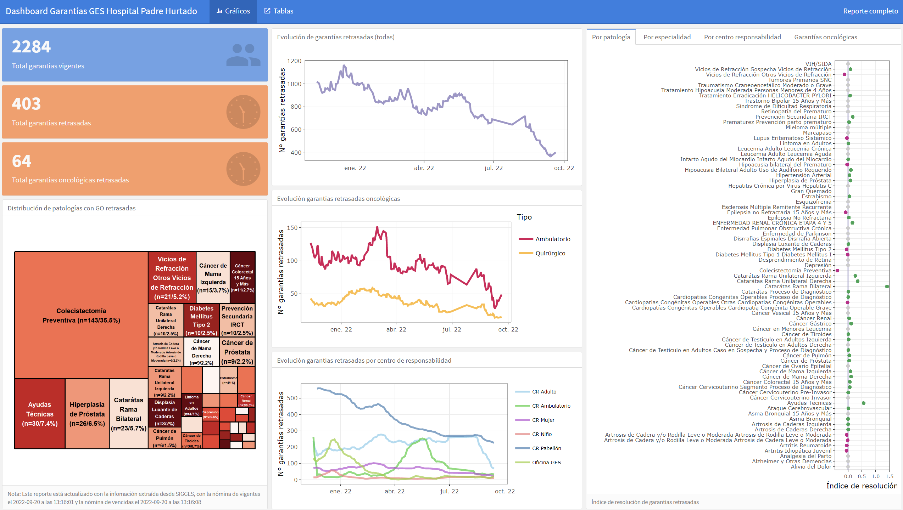
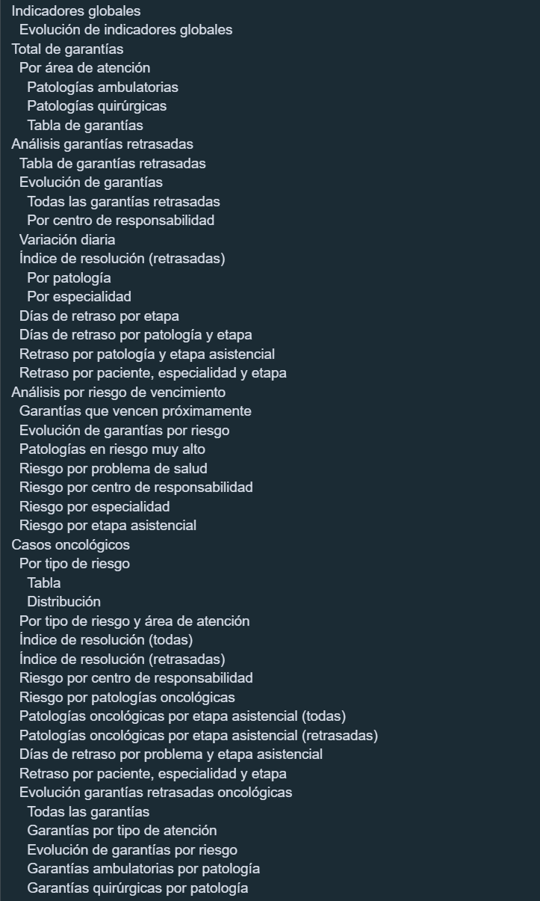
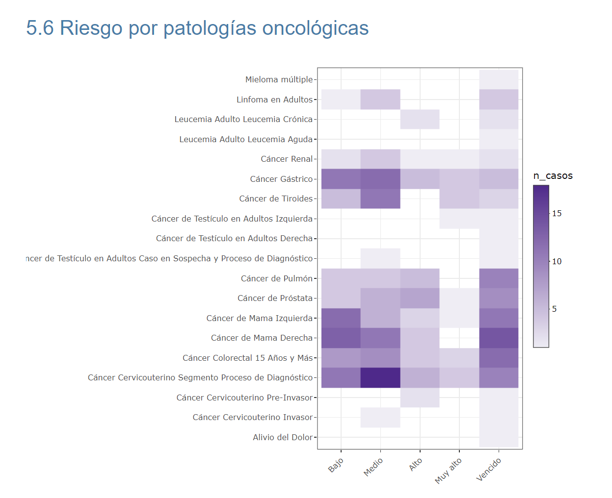
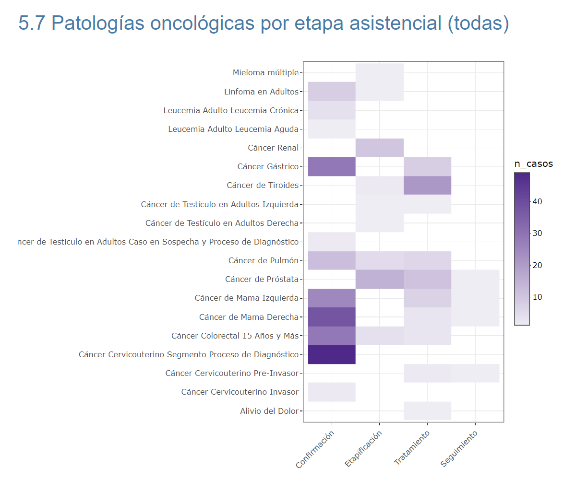

```{css, echo = FALSE}
.remark-slide-content {
  font-size: 28px;
  padding: 20px 80px 20px 80px;
}
.remark-code, .remark-inline-code {
  background: #f0f0f0;
}
.remark-code {
  font-size: 24px;
}
.huge .remark-code { /*Change made here*/
  font-size: 200% !important;
}
.tiny .remark-code { /*Change made here*/
  font-size: 40% !important;
}
```
---

class: chapter-slide

# Hola `r emo::ji("smile")`

---
# Ley de garantías explícitas de salud (GES)

- En Chile, la Ley GES que establece plazos máximos para atenciones de ciertas patologías. Actualmente son 85 grupos de patologías.
- Un hospital mediano, puede llegar a administrar cerca de 3000 a 4000 casos diarios. Es decir, personas que están a la espera de atenciones, exámenes, cirugias o tratamientos. 
- Debido al gran volumen de datos, diversidad de especialidades, tipos de atenciones y al ser una exigencia legal, se hace necesario que las instituciones mantengan sistemas de información adecuados, análisis de datos y cuenten con modelos de gestión que faciliten el cumplimiento de los plazos de atención. 
- Además, que la generación de reportes es una tarea muy frecuente para las áreas a cargo del monitoreo GES.

---

# Plataforma SIGGES

A nivel central y de alcance nacional, existe una plataforma de registro de los pacientes que pertenecen a la Ley GES. Este sistema se llama SIGGES (sistema de gestión de garantías explícitas de salud).
El uso de esta plataforma es obligatorio para el sector público de salud.
Pero esta plataforma no ofrece muchas funcionalidades para el análisis de datos. 

En general, se pueden descargar diversos registros en Excel, pero que son necesario de manipular, ajustar y realizar una serie de transformaciones para que sean útiles. Además, que estas labores de limpieza deben realizarse cada vez que necesite generar un reporte,lo cual puede ocurrir varias veces al día.

---

# Reporte automatizado 1/2

- Para facilitar las tareas de limpieza y transformación, es que generamos un reporte que lo hiciera de forma automática.
- Además, el reporte incluye una serie de análisis y visualizaciones que facilitan el análisis exploratorio y la minería de datos. 
- Esto es realmente importante, pues facilita la comunicación del estado del arte del cumplimiento de plazos GES hacia unidades de negocios y dirección (unidades no técnicas).
- Facilita la focalización de acciones de mejora, pues se generan diversos indicadores de desempeño y evolución en el tiempo de éstos.

---

# Reporte automatizado 2/2

- Incluye un modelo de riesgo de vencimiento de los plazos, que categoriza a los pacientes.
- Dado que usa como fuente las bases Excel oficiales desde SIGGES, este reporte se puede utilizar por cualquier hospital de Chile, aún cuando requiere algunos ajustes menores para adaptarlo a la estructura organizacional de cada uno.
- El reporte incluye un informe detallado del estado del cumplimiento de plazos y un dashboard resumen.

---

class: chapter-slide

# El reporte...

---
.tiny[
```{r eval=FALSE, include=TRUE}

total_ges <- rbind(ges_vigentes, ges_vencidas) |>
  mutate(
    problema_de_salud = str_remove(problema_de_salud,
      pattern = "(\\s?[.]?\\s?[{]\\w+\\s\\w+.\\s?\\d+.?\\d+.)"
    ),
    fecha_de_inicio = ymd(fecha_de_inicio),
    fecha_limite = ymd(fecha_limite),
    rut = as.character(rut), 
    plazo_ges = as.numeric(fecha_limite - fecha_de_inicio),
    dias_avanzados = as.numeric(today() - fecha_de_inicio),
    dias_retraso = ifelse(fecha_limite >= today(), NA_integer_, as.numeric(today() - fecha_limite)),
    plazo_interno = plazo_ges * 0.7,
    fecha_interna = fecha_de_inicio + plazo_interno,
    indice_resolucion = dias_avanzados / plazo_ges,
    riesgo = case_when(
      indice_resolucion > 1 ~ "Vencido",
      indice_resolucion >= 0.9 ~ "Muy alto",
      indice_resolucion < 0.9 & indice_resolucion >= 0.7 ~ "Alto",
      indice_resolucion < 0.7 & indice_resolucion >= 0.35 ~ "Medio",
      indice_resolucion < 0.35 ~ "Bajo"
    ),
    riesgo = factor(riesgo, levels = c(
      "Bajo",
      "Medio",
      "Alto",
      "Muy alto",
      "Vencido"
    )),
    garantia = case_when(
      indice_resolucion > 1 ~ "Vencido",
      indice_resolucion <= 1 ~ "Vigente"
    ),
    vence_15 = case_when(
      fecha_limite - today() <= 15 & fecha_limite - today() >= 0 ~ TRUE,
      TRUE ~ FALSE
    ),
    vence_7 = case_when(
      fecha_limite - today() <= 7 & fecha_limite - today() >= 0 ~ TRUE,
      TRUE ~ FALSE
    )
  )
```
]

---



---



---



---



---

# Finalmente...

- Reducción de tiempo para generar reportes.
- Automatiza las tareas manuales. 
- Reducción de errores.
- Facilita le monitoreo y supervisión.
- Facilita el EDA.
- Agrega dimensiones al análisis (serie de tiempo, etapas, servicios clínicos).

---

class: chapter-slide
# Necesitamos una mejor salud pública y R es una gran ayuda para lograrlo 💪

---

class: chapter-slide

# Muchas gracias! 🤟
